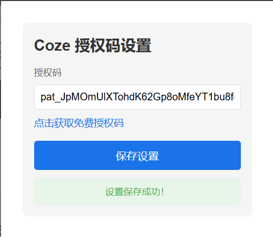

# Coze文章总结助手

一个基于Coze API的Chrome浏览器扩展，可以快速总结网页内容。

## 功能特点

- 简洁的悬浮球界面
- 一键总结当前网页内容
- 支持拖拽调整悬浮球位置
- 授权码配置界面
- 实时响应和错误提示

## 安装说明

1. 下载源代码并解压
2. 配置授权码

   - 点击插件图标打开设置界面
   - 输入你的Coze授权码并保存
   - 获取免费授权码: https://blog.yeadon.top/article/452d1ef9-9260-4dba-bfcc-2bd8abf60890
3. 在Chrome浏览器中加载插件

   - 打开Chrome扩展程序页面 (chrome://extensions/)
   - 开启"开发者模式"
   - 点击"加载已解压的扩展程序"
   - 选择解压后的文件夹
4. 

## 使用方法

1. 加载扩展程序
2. 打开任意网页
3. 固定插件
4. 点击popup的插件按钮配置授权码
5. 点击右侧悬浮球图标
6. 等待分析完成即可查看总结内容

## 文件说明

- `manifest.json`: 插件配置文件
- `popup.html`: 授权码设置界面
- `popup.js`: 授权码设置逻辑
- `floatBall.js`: 主要功能实现
- `floatBall.css`: 悬浮球样式
- `icon.png`: 插件图标
- `avatar.png`: 作者头像
- `qrcode.png`: 二维码图片

## 注意事项

- 使用前必须先配置有效的授权码
- 确保网页内容加载完成后再点击总结
- 部分网站可能因为安全限制无法访问

## 技术支持

如有问题请联系作者:

- 博客: https://blog.yeadon.top
- 微信: vip2022shopee

## 许可说明

本项目仅供学习交流使用，请勿用于商业用途。
